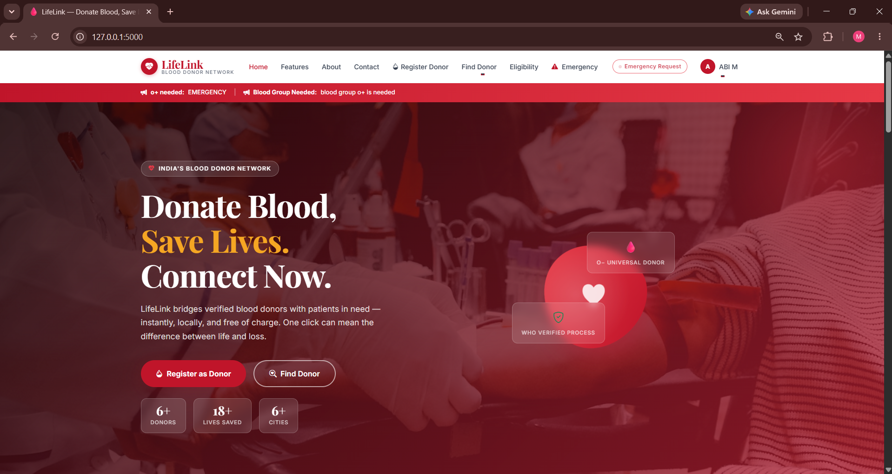
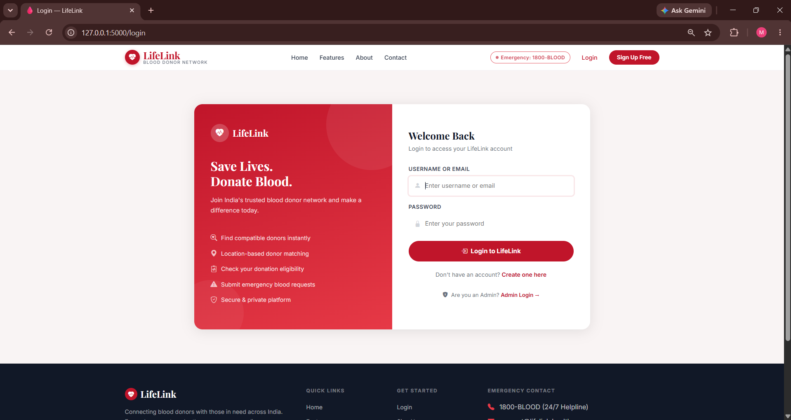
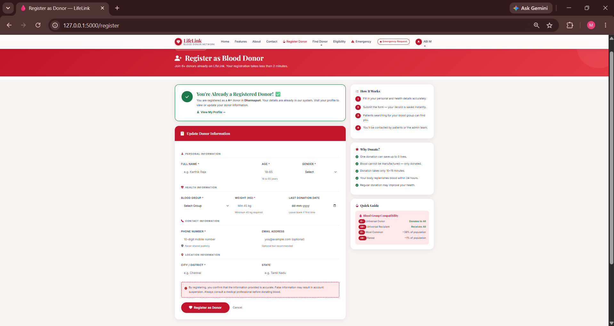
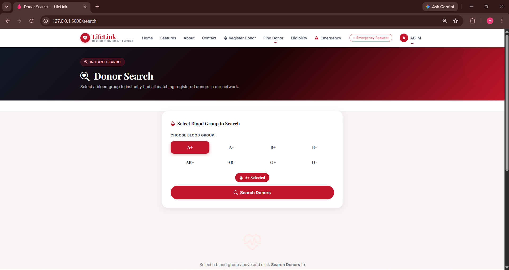
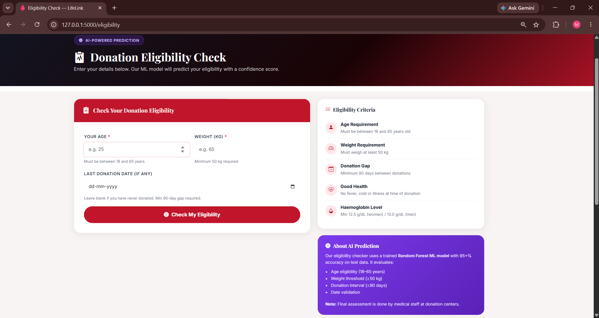
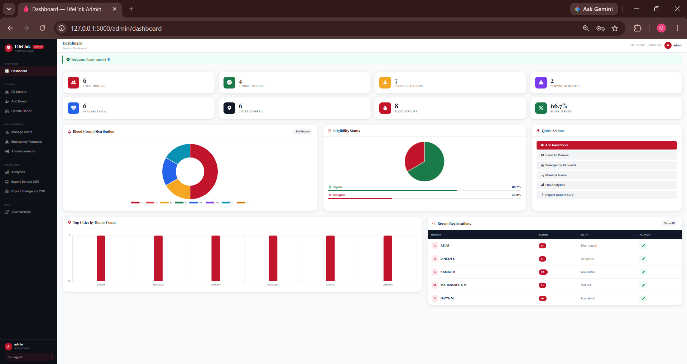
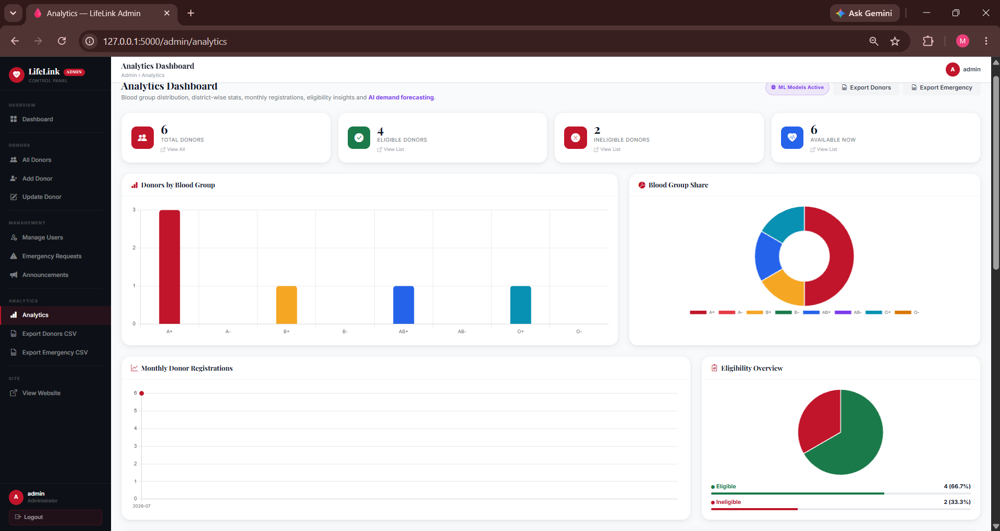
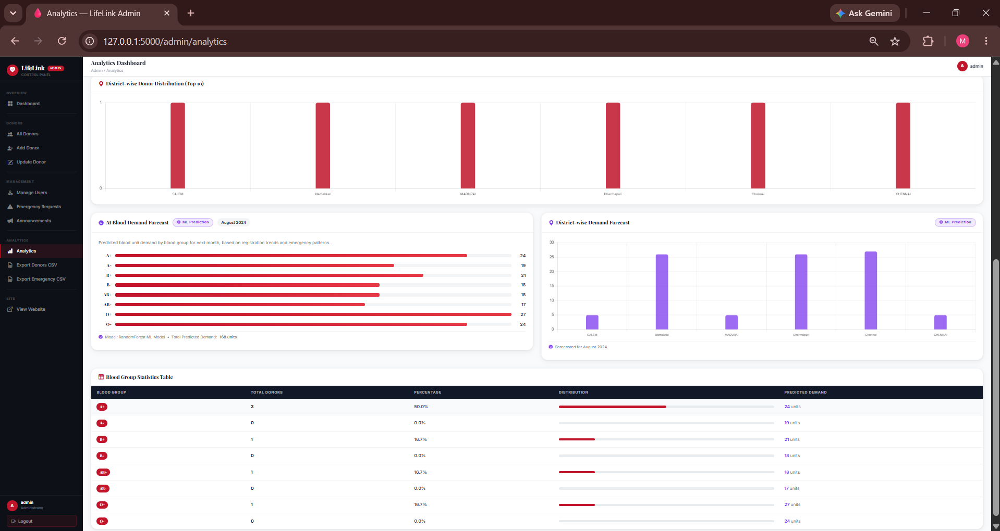

# 🩸 LifeLink – AI Blood Donor Network

An AI-powered Blood Donor Finder and Donation Analytics System developed using Flask, Machine Learning, SQLite, HTML, CSS, JavaScript, and Bootstrap.

This project helps users quickly find suitable blood donors based on blood group and location while providing AI-based donor recommendation and eligibility prediction.

---
# 📸 Project Screenshots

## 🏠 Home Page


---

## 🔐 User Login


---

## 🩸 Donor Registration


---

## 🔍 Find Donor


---

## 🧠 Eligibility Prediction


---

## 👨‍💼 Admin Dashboard


---

## 📊 Analytics Dashboard - Overview


---

## 📈 Analytics Dashboard - Reports


---

# 🚀 Features

## 👤 User Module

- Secure User Registration & Login
- Register as Blood Donor
- Find Blood Donors
- AI Donor Recommendation
- AI Eligibility Prediction
- Location-Based Donor Matching
- Emergency Blood Request
- User Profile Management
- Privacy & Security

---

## 👨‍💼 Admin Module

- Secure Admin Login
- View All Donors
- Update Donor Details
- Delete Donor
- Manage Users
- Emergency Request Management
- Analytics Dashboard
- Export CSV Reports
- Blood Group Analytics
- District-wise Analytics
- Monthly Registration Analytics

---

# 🤖 AI & Machine Learning Features

- AI Eligibility Prediction
- AI Donor Recommendation
- Blood Demand Forecasting
- Donation Analytics Dashboard

---

# 🛠 Tech Stack

### Frontend
- HTML5
- CSS3
- Bootstrap 5
- JavaScript

### Backend
- Python
- Flask

### Database
- SQLite

### Machine Learning
- Scikit-learn
- Pandas
- NumPy

---

# 📂 Project Structure

```text
LifeLink/
│── app.py
│── config.py
│── database.py
│── datasets/
│── ml/
│── models/
│── static/
│── templates/
│── README.md
```

---

# ▶️ How to Run

```bash
git clone <repository-url>
cd LifeLink
pip install -r requirements.txt
python app.py
```

---

# 📈 Future Enhancements

- Email Notifications
- SMS Alerts
- Hospital Integration
- Blood Bank Integration
- Mobile Application
- Cloud Deployment

---

# 👩‍💻 Author

**Monica P**

B.Tech Artificial Intelligence & Machine Learning

Machine Learning | AI | Python | Flask | ML Engineer